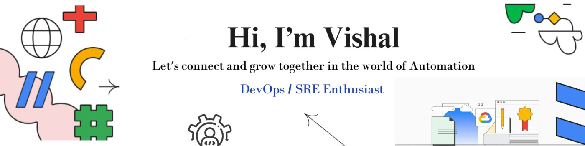

# Hey there!! I'm Vishal D. Gunjal 👋🏻:

## A Passionate Indian Developer Fueled By A Thirst For Knowledge & A Love For Conquering New Technical Peaks (Both In Code & On Actual Mountains!!) ‍♂️

<!-- markdownlint-disable MD033 -->

<!-- <--  -->

<!-- markdownlint-enable MD033 -->

Now that we have that out of the way, let me tell you a bit about myself 

## **Currently on a Quest**:

- **DevOps & SRE Domination:** Mastering the art of deploying, scaling, and automating with tools like Jenkins, Docker, Kubernetes, Terraform, Ansible and the AWS, GCP Cloud Platform.  (Hit me up if you want to chat containers or serverless!!)
- **Full-Stack Finesse:** Sharpening my React and Node.js skills to become a well-rounded developer. (Front-end or back-end, I'm game!)
- **Kubernetes Conquest:** Setting up a killer Istio mesh with Jaeger and Kiali on AWS EKS (or maybe you have a different cloud platform in mind? Let's talk!). ☁️
- Expanding my knowledge in **GCP** and preparing for **GCP certifications** to excel as a fresher DevOps engineer.

## 🚀 **Leveling Up My Skills:**

- **Leetcoding my Way to Algorithmic Awesomeness:** Practice on LeetCode to conquer those coding challenges. ⚔️
- **Actively Engaged:** Member of Google Developer Group Pune & Atlassian Community Pune. Active Participant in Tech Conferences to Stay Ahead with Emerging Technologies. Let's connect at the next tech meet-up!

## 🏞️ **Beyond the Code:**

- **Off-the-beaten-path Enthusiast:** When I'm not coding, I'm exploring hidden hiking trails (Mailbox Peak anyone? ). Let's swap travel stories! ️
- **Punctuation Pedant:** Yes, I know I love complete sentences (it's a developer thing!).

## 📌 **Remember:** I'm always learning and growing. Feel free to reach out and connect!

## 🌐 Socials:         

<source media="(prefers-color-scheme: dark)" srcset="https://raw.githubusercontent.com/tobiasmeyhoefer/tobiasmeyhoefer/output/github-snake-dark.svg" />

<picture>
  <source media="(prefers-color-scheme: dark)" srcset="https://raw.githubusercontent.com/tobiasmeyhoefer/tobiasmeyhoefer/output/github-snake-dark.svg" />
  <source media="(prefers-color-scheme: light)" srcset="https://raw.githubusercontent.com/tobiasmeyhoefer/tobiasmeyhoefer/output/github-snake.svg" />
  
</picture>

## 💻 Tech Stack:

                                                        

## 📊 GitHub Stats:

 |  

## 🏆 GitHub Trophies

## ✍️ Dev Quote

---
