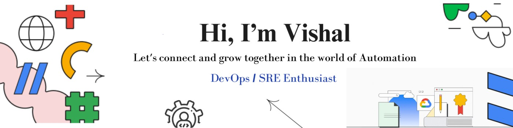

<!-- Banner Image -->

 


<!-- Introduction -->
**Site Reliability Engineer | Platform Engineering | Distributed Systems**

> Early-career engineer with senior-level systems thinking. Building production-grade cloud platforms demonstrating reliability, observability, and automation principles used by Google, Netflix, and Uber.
```
Current: Production-grade Kubernetes platforms, SRE observability, GitOps at scale
Approach: Build systems that teach industry patterns, not tutorials
Philosophy: Infrastructure should be boring (reliable), not exciting (breaking)
```
---
**💼 Open to opportunities:** DevOps Engineer | SRE | Platform Engineer | Cloud Engineer  
**📍 Location:** Pune, India (Open to Remote & Relocation)
## 


<p align="center">
  <a href="mailto:vishalgunjal0287@gmail.com">
    
  </a>
  &nbsp;&nbsp;
  <a href="https://www.linkedin.com/in/vishalgunjal1">
    
  </a>
  &nbsp;&nbsp;
  <a href="tel:+919022717020">
    
  </a>
</p>


---

## 🚀 What I Do

I specialize in **cloud-native infrastructure** and **platform engineering**, with hands-on experience building:

- **Microservices platforms** on AWS EKS with event-driven architecture (RabbitMQ, Kafka)
- **Infrastructure as Code** using Terraform with modular, reusable patterns
- **GitOps workflows** with ArgoCD for declarative, drift-free deployments
- **Full observability stacks** (Prometheus, Grafana, ELK, Jaeger)
- **DevSecOps pipelines** with automated security scanning (SonarQube, Trivy)

---

## 💼 Current Focus

- 🔨 Building production-grade DevOps projects demonstrating enterprise patterns
- 📚 Deep-diving into **Kubernetes** (RBAC, Network Policies, Security, Operators)
- 🔐 Implementing **DevSecOps** practices (shift-left security, policy-as-code)
- 📊 Designing **SRE observability** systems (SLIs, SLOs, error budgets)
- 🤖 Exploring **MLOps** and **AI-driven infrastructure automation**

---

## 🧠 Engineering Philosophy (Borrowed from Google SRE)

| Principle | What It Means | How I Apply It |
|-----------|---------------|----------------|
| **Everything Fails** | Design for failure, not success | Multi-AZ, circuit breakers, graceful degradation |
| **Toil is the Enemy** | Automate repetitive work | GitOps, drift detection, self-healing |
| **Observability ≠ Monitoring** | Understand unknowns | Distributed tracing, correlation IDs, SLOs |
| **Security by Default** | Zero trust | RBAC, Network Policies, no hardcoded secrets |
| **Error Budgets** | Balance velocity and reliability | SLI/SLO tracking, controlled risk |

**I don't believe in:**
- Manual deployments ("works on my machine" syndrome)
- Infrastructure without monitoring
- Code without tests or automation without guardrails
---

## 🛠️ Tech Stack

<table align="center">
  <tr>
    <td align="center" width="96">
      <br>AWS
    </td>
    <td align="center" width="96">
      <br>Azure
    </td>
    <td align="center" width="96">
      <br>GCP
    </td>
    <td align="center" width="96">
      <br>Kubernetes
    </td>
    <td align="center" width="96">
      <br>Docker
    </td>
    <td align="center" width="96">
      <br>Terraform
    </td>
  </tr>
  <tr>
    <td align="center" width="96">
      <br>Ansible
    </td>
    <td align="center" width="96">
      <br>Helm
    </td>
    <td align="center" width="96">
      <br>Linux
    </td>
    <td align="center" width="96">
      <br>Jenkins
    </td>
    <td align="center" width="96">
      <br>GitHub Actions
    </td>
    <td align="center" width="96">
      <br>ArgoCD
    </td>
  </tr>
  <tr>
    <td align="center" width="96">
      <br>Grafana
    </td>
    <td align="center" width="96">
      <br>Prometheus
    </td>
    <td align="center" width="96">
      <br>ELK
    </td>
    <td align="center" width="96">
      <br>Go
    </td>
    <td align="center" width="96">
      <br>Python
    </td>
    <td align="center" width="96">
      <br>Git
    </td>
  </tr>
</table>

---
## 🌟 What Sets Me Apart (Early Career with Senior Thinking)

### **1. I Think in Systems, Not Tools**

Most engineers: "I know Docker, Kubernetes, Terraform"

Me: "I understand distributed systems failure modes and design infrastructure that degrades gracefully. I use Kubernetes for declarative state reconciliation and self-healing, not because it's trendy."

##

### **2. I Design for Failure**

Most engineers: "My app works in testing"

Me: "I've tested:
- What happens when RabbitMQ goes down? (DLQ prevents message loss)
- What if Redis crashes? (Cache-aside handles misses)
- What if AWS loses an AZ? (Multi-AZ with auto-failover)"

##

### **3. I Document Decisions**

Most engineers: "I built it"

Me: "I documented:
- WHY I chose RabbitMQ over Kafka (trade-off analysis)
- Architecture diagrams (system design)
- Runbooks (production operations)
- What I learned from failures"

---

<!-- ## 📝 Technical Writing

I write in-depth technical articles explaining the "why" behind infrastructure decisions:

**Recent Articles:**
- **Kubernetes RBAC Deep-Dive** - Implementing least-privilege access patterns
- **GitOps vs Traditional CD** - Trade-offs and decision framework
- **Terraform State Management** - Remote state, locking, and team collaboration
- **Observability Patterns** - Metrics, logs, traces, and correlation strategies

  </a>
    <a href="https://medium.com/@vishalgunjal" target="_blank">
    
  </a>
</p> -->

## 🧠 Systems Thinking & Engineering

I explore the trade-offs in distributed systems, documenting my journey from "how it works" to "why it breaks."

> *"I'm fascinated by systems that scale, self-heal, and never go down."*

##

<!-- BLOG-POST-LIST:START -->
- 📝 [How To Achieve Kubernetes High Availability](https://vishalgunjal.medium.com/how-to-achieve-kubernetes-high-availability-815b7f8c2d4d?source=rss-460998244e54------2) — 04 Mar 2026
- 📝 [Kubernetes Architecture Explained: An Early-Career Perspective &lpar;2026 Edition&rpar;](https://vishalgunjal.medium.com/kubernetes-architecture-explained-an-early-career-perspective-2026-edition-62071ef9b969?source=rss-460998244e54------2) — 14 Feb 2026
- 📝 [Non-Deterministic Workloads in a Deterministic World: SRE Lessons from the AI Frontier](https://vishalgunjal.medium.com/non-deterministic-workloads-in-a-deterministic-world-sre-lessons-from-the-ai-frontier-0d1213fec8d1?source=rss-460998244e54------2) — 03 Feb 2026
- 📝 [Part 10/10: The SRE Mindset- Engineering Systems That Do Not Depend on You](https://vishalgunjal.medium.com/part-10-10-the-sre-mindset-engineering-systems-that-do-not-depend-on-you-937ac3f56623?source=rss-460998244e54------2) — 16 Jan 2026
- 📝 [DevSecOps: Engineering Security as a Non-Negotiable Quality Gate](https://vishalgunjal.medium.com/devsecops-engineering-security-as-a-non-negotiable-quality-gate-905baf23e6c9?source=rss-460998244e54------2) — 14 Jan 2026<!-- BLOG-POST-LIST:END -->

> *I document the **"why" behind my code** — deep dives into Engineering Systems, FinOps, Scalability, and SRE practices.*  
>  
> [](https://medium.com/@vishalgunjal)


---

## 🌐 Community Involvement

**Active Participation:**
- **Google Developer Group (GDG) Pune** - Cloud-native discussions, hands-on labs
- **CNCF Community** - Kubernetes, service mesh, observability
- **AWS User Group Pune** - Best practices, architecture patterns
- **Atlassian Community Pune** - CI/CD, DevOps automation

---

## 🎯 2026 Goals

**Technical:**
- ✅ Build 4 production-grade cloud platforms (End-to-End)
- 🔄 Contribute to CNCF projects (Kubernetes, Prometheus, ArgoCD)
- 📚 Deep-dive into Kubernetes operators and CRDs
- 🔐 Master service mesh (Istio/Linkerd) and zero-trust networking
- 🤖 Explore MLOps and infrastructure for ML workloads

**Professional:**
- 📝 Publish 25+ in-depth technical articles
- 🎤 Present at CNCF Pune and AWS User Group
- 💼 Land first DevOps/SRE role as a early-career engineer
- 🌟 Contribute to open-source (Kubernetes, Terraform providers, Helm charts)

**Learning:**
- 📖 Complete AWS DevOps Professional certification
- 📖 Complete CKA and CKS certifications before 2027
- 📖 Study distributed systems papers (Raft, Paxos, CAP theorem)

---

## 💡 Questions That Keep Me Up at Night
```
→ How does Kubernetes handle split-brain in etcd?
→ What's the optimal error budget for a new service?
→ How do you design alerts that don't cause fatigue?
→ What's the CAP theorem trade-off in my architecture?
→ How would Netflix design this system?
→ What's the failure mode I haven't considered?
```

**I don't just want to use tools. I want to understand the engineering decisions behind them.**

**Currently Reading:**
- 📖 Site Reliability Engineering (Google SRE Book)
- 📖 Designing Data-Intensive Applications (Martin Kleppmann)
- 📖 Kubernetes Patterns (Bilgin Ibryam)
- 📖 Raft Consensus Paper (understanding distributed systems)

---

## 📈 Contribution Graph

[](https://github.com/vishalgunjalSWE)

---

<p align="center">
  
</p>

<p align="center">
  <i>⚡ "Automation is not about replacing humans, it's about freeing them to do what they do best."</i>
</p>

---
