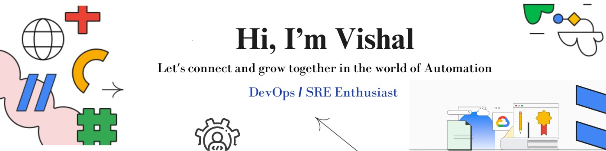

<div align="center">
  
  
  <br><br>
  
  <h1>⌘ Vishal Gunjal</h1>
  <p><b>Site Reliability Engineer • Platform Engineering • Distributed Systems</b></p>
  
  <p>
    <a href="mailto:vishalgunjal0287@gmail.com"></a>
    <a href="https://www.linkedin.com/in/vishalgunjal1"></a>
    <a href="tel:+919022717020"></a>
    <a href="https://vishalgunjalops.vercel.app"></a>
  </p>

  <blockquote>
    Early-career engineer with senior-level systems thinking. Building production-grade cloud platforms demonstrating reliability, observability, and automation principles used by Google, Netflix, and Uber.
  </blockquote>
</div>

<br>

```text
[SYSTEM: OVERVIEW]
Current    : Production-grade Kubernetes platforms, SRE observability, GitOps at scale
Approach   : Build systems that teach industry patterns, not tutorials
Philosophy : Infrastructure should be boring (reliable), not exciting (breaking)
Status     : 💼 Open to opportunities (DevOps | SRE | Platform | Cloud) • 📍 Pune, India / Remote
```

---

### 🚀 Core Competencies

I specialize in **cloud-native infrastructure** and **platform engineering**, with hands-on experience building:

*   **Microservices Platforms:** AWS EKS with event-driven architecture (RabbitMQ, Kafka).
*   **Infrastructure as Code:** Terraform with modular, reusable, and state-managed patterns.
*   **GitOps Workflows:** ArgoCD for declarative, drift-free, and automated deployments.
*   **Observability Stacks:** Prometheus, Grafana, ELK, and distributed tracing (Jaeger).
*   **DevSecOps Pipelines:** Automated security scanning (SonarQube, Trivy) with shift-left policies.

---

### 🛠️ Technology Matrix

<div align="center">
<table>
<tr>
<td align="center" width="96"><br>AWS</td>
<td align="center" width="96"><br>Azure</td>
<td align="center" width="96"><br>GCP</td>
<td align="center" width="96"><br>K8s</td>
<td align="center" width="96"><br>Docker</td>
<td align="center" width="96"><br>Terraform</td>
</tr>
<tr>
<td align="center" width="96"><br>Ansible</td>
<td align="center" width="96"><br>Linux</td>
<td align="center" width="96"><br>Jenkins</td>
<td align="center" width="96"><br>Actions</td>
<td align="center" width="96"><br>ArgoCD</td>
<td align="center" width="96"><br>Grafana</td>
</tr>
<tr>
<td align="center" width="96"><br>Prometheus</td>
<td align="center" width="96"><br>ELK Stack</td>
<td align="center" width="96"><br>Go</td>
<td align="center" width="96"><br>Python</td>
<td align="center" width="96"><br>Bash</td>
<td align="center" width="96"><br>Git</td>
</tr>
</table>
</div>

---

### 🧠 Engineering Philosophy (Borrowed from Google SRE)

| Principle | What It Means | How I Apply It |
| :--- | :--- | :--- |
| **Everything Fails** | Design for failure, not success. | Multi-AZ deployments, circuit breakers, graceful degradation. |
| **Toil is the Enemy** | Automate repetitive work. | GitOps, drift detection, self-healing infrastructure. |
| **Observability ≠ Monitoring** | Understand the unknowns. | Distributed tracing, correlation IDs, SLIs/SLOs. |
| **Security by Default** | Zero trust architecture. | RBAC, Network Policies, no hardcoded secrets (Vault/SOPS). |
| **Error Budgets** | Balance velocity and reliability. | SLO tracking, controlled risk, deployment freezes. |

---

### 🌟 What Sets Me Apart

**1. I Think in Systems, Not Tools**  
> *Most engineers:* "I know Docker, Kubernetes, and Terraform."  
> **Me:** "I understand distributed systems failure modes. I use Kubernetes for declarative state reconciliation and self-healing, not because it's trendy."

**2. I Design for Failure**  
> *Most engineers:* "My app works in testing."  
> **Me:** "I've tested the blast radius: What happens when RabbitMQ goes down? (DLQ prevents message loss). What if AWS loses an AZ? (Multi-AZ with auto-failover)."

**3. I Document Decisions (RFCs & ADRs)**  
> *Most engineers:* "I built it."  
> **Me:** "I documented *why* I chose RabbitMQ over Kafka, mapped the architecture, wrote the runbooks, and logged the post-mortem of what I learned when it broke."

---

### 📡 System Telemetry & Writing

I explore the trade-offs in distributed systems, documenting my journey from "how it works" to "why it breaks."

*   📝 [How To Achieve Kubernetes High Availability](https://vishalgunjal.medium.com/how-to-achieve-kubernetes-high-availability-815b7f8c2d4d)
*   📝 [Kubernetes Architecture Explained: An Early-Career Perspective (2026 Edition)](https://vishalgunjal.medium.com/kubernetes-architecture-explained-an-early-career-perspective-2026-edition-62071ef9b969)
*   📝 [Non-Deterministic Workloads in a Deterministic World: SRE Lessons from the AI Frontier](https://vishalgunjal.medium.com/non-deterministic-workloads-in-a-deterministic-world-sre-lessons-from-the-ai-frontier-0d1213fec8d1)
*   📝 [The SRE Mindset: Engineering Systems That Do Not Depend on You](https://vishalgunjal.medium.com/part-10-10-the-sre-mindset-engineering-systems-that-do-not-depend-on-you-937ac3f56623)
*   📝 [DevSecOps: Engineering Security as a Non-Negotiable Quality Gate](https://vishalgunjal.medium.com/devsecops-engineering-security-as-a-non-negotiable-quality-gate-905baf23e6c9)

<div align="center">
  <a href="https://medium.com/@vishalgunjal"></a>
</div>

---

### 🎯 Current Operations & Goals

*   **Community:** Active in GDG Pune, CNCF Community, AWS User Group, and Atlassian Community.
*   **Technical Targets:** Deep-diving into Kubernetes operators, CRDs, Istio Service Mesh, and Zero-Trust Networking.
*   **Certifications:** Studying for CKA, CKS, and AWS DevOps Professional.

<br>

```bash
#!/bin/bash
# Questions That Keep Me Up at Night

echo "→ How does Kubernetes handle split-brain in etcd?"
echo "→ What's the optimal error budget for a new service?"
echo "→ How do you design alerts that don't cause fatigue?"
echo "→ What's the CAP theorem trade-off in my architecture?"
echo "→ What is the failure mode I haven't considered yet?"
```

---

<div align="center">
  
  
  <br><br>
  
  <i>⚡ "Automation is not about replacing humans, it's about freeing them to do what they do best."</i>
  
  <br><br>
  
  
</div>
